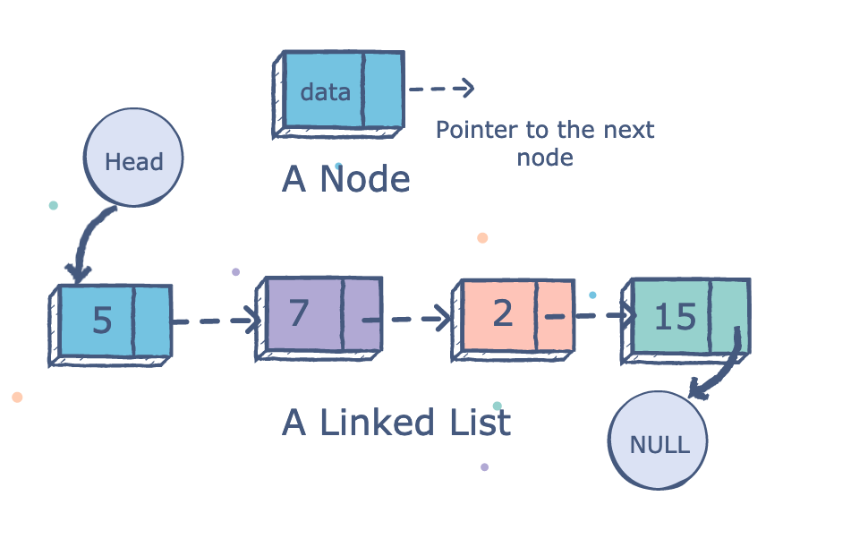

# Linked List - 연결 리스트



<hr/>

### 1. 개념

* 노드(node)와 링크(link)를 구조화 시킨 것
  * 노드(node) : 데이터를 담고 있는 그릇
  * 링크(link) : 리스트의 순서를 유지해주는 연결고리

* 특징
  * 데이터를 순서대로 저장한다.
  * 요소를 계속 추가 가능하다.
* 배열과의 비교
  * 공통점 : 순차적으로 데이터를 저장하는 것
  * 차이점
    * 연결리스트 : 계속해서 동적으로 늘였다 줄였다 할 수있다.
    * 배열 : 선언할 때 저장할 공간을 미리 저장해야한다.
<br/>
<br/>

```python
"""
    간단하게 Node클래스와 LinkedList클래스를 구현하면서
    연결리스트를 문자열로 표현해주기 위해 __str__메소드를
    정의해 보았다.
"""

class Node:
    def __init__(self,data):
        self.data = data
        self.next = None

class LinkedList:
    def __init__(self):
        self.head = None
        self.tail = None
    def append(self, data):
        new_node = Node(data)

        if self.head is None:
            self.head = new_node
            self.tail = new_node
        else:
            self.tail.next = new_node
            self.tail = new_node
    def __str__(self):
        res_str = "| "

        iterator = self.head

        while iterator is not None:
            """
                python(3.6이상)코드에서 f-string을 사용하면
                더욱 직관적으로 표현 가능할 수 있음을 새로 알게되었다.
            """
            res_str += f"{iterator.data} | "
            iterator = iterator.next

        return res_str

linked_list = LinkedList()

linked_list.append(2)
linked_list.append(3)
linked_list.append(5)

print(linked_list)
```
- 실행 결과
>| 2 | 3 | 5 | 

연결 리스트 접근 연산 : 특정 위치에 있는 Node를 Return하는 연산